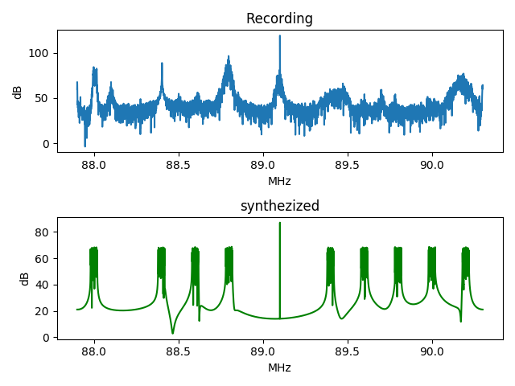
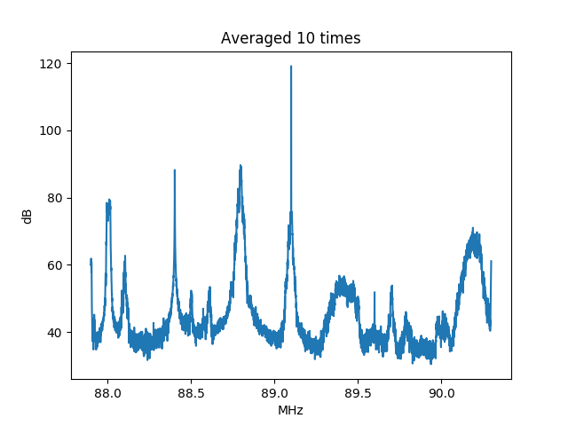

This directory contains a test program from Federico Di Vruno (F.DiVruno@skatelescope.org). He writes

*Here is a python script that reads IQ recordings of radio stations (I think in the UK, 
but this is proof of concept only) and plot the spectrum. I haven’t asked but I suppose 
you can run Python3 scripts. The script is commented “as minimum necessary”, please ask if 
something is not clear. You will need to have numpy, wave and matplotlib installed. The link to 
download the wav file with the recording is provided in the start of the script, check the 
name of the file I was using. Also there is a section of the script that generates a 
similar signal with tones, outputs spectrums of the script are like this:*

The line IDs are 
* 88.0 - Pulse
* 88.4 - Vision (Blank Carrier)
* 88.6 - Back2Back FM
* 89.24 - Image of 86.84
* 89.4 - Citylock Radio
* 89.6 - Westside (Community)
* 89.8 - Station FM
* 90.0 - Hot 90
* 90.2 - Point Blank

